# Create a Virtual Machine

*** This article presumes you already have an active Azure account and are logged in https://portal.azure.com.

Step 1 - Click on the burguer menu and locate the Virtual Machines option (Or use the search bar for the same).

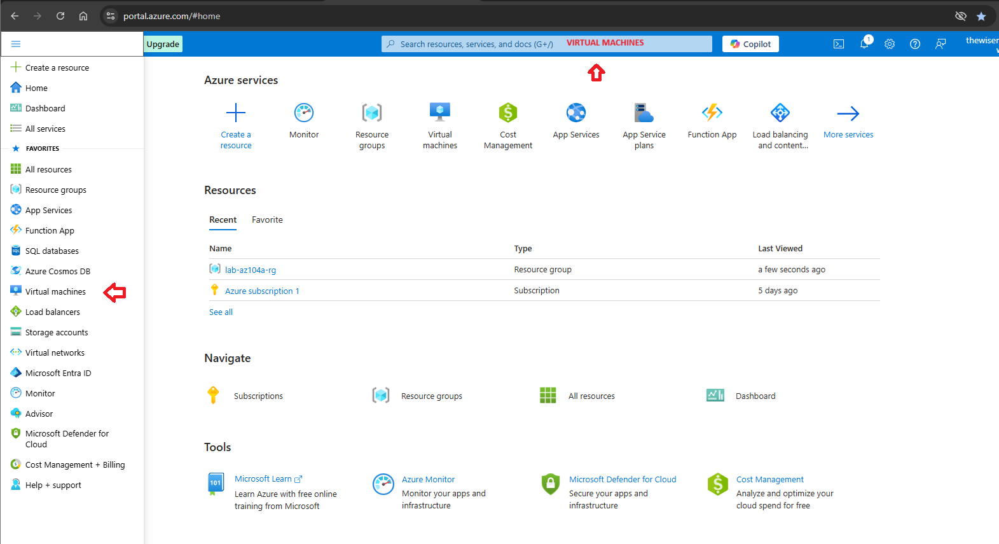

Step 2 - In the virtual machines section click on create and choose Virtual machine.

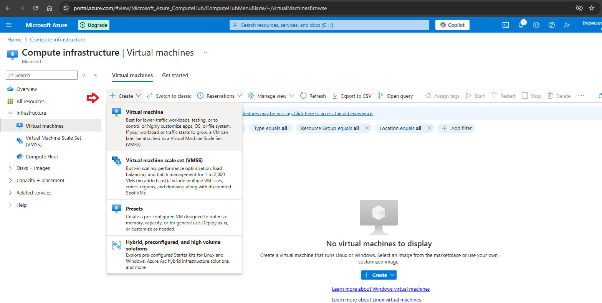

Step 3 - Basics - Fulfill all the mandatory fields based on a previously defined objective and strategy (Region, availability, image, size, etc) scrolling down the page until the end. Then click Next.

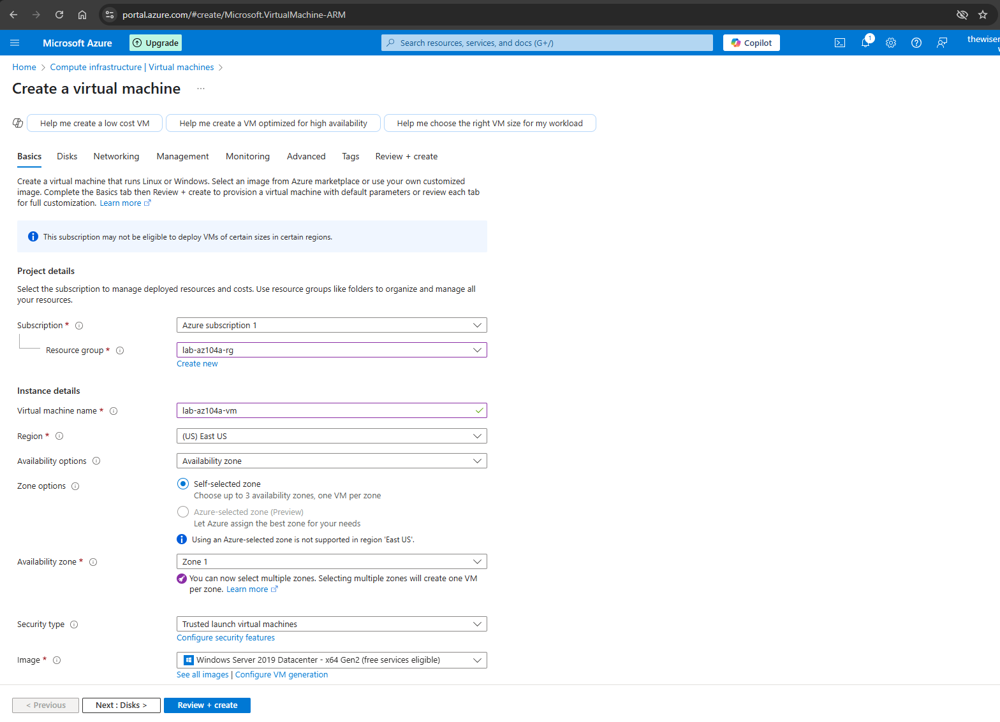
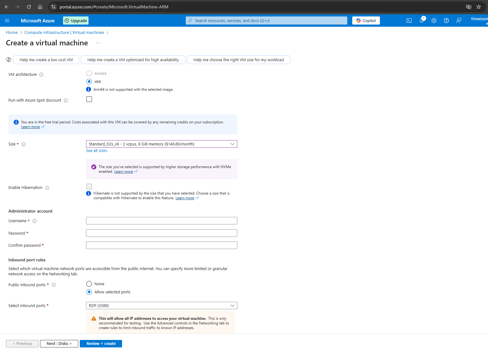

Step 4 - Disks - Choose the OS disk type option best suited to you. Check Delete with VM if you do not want to persist the disk in case of VM deletion.

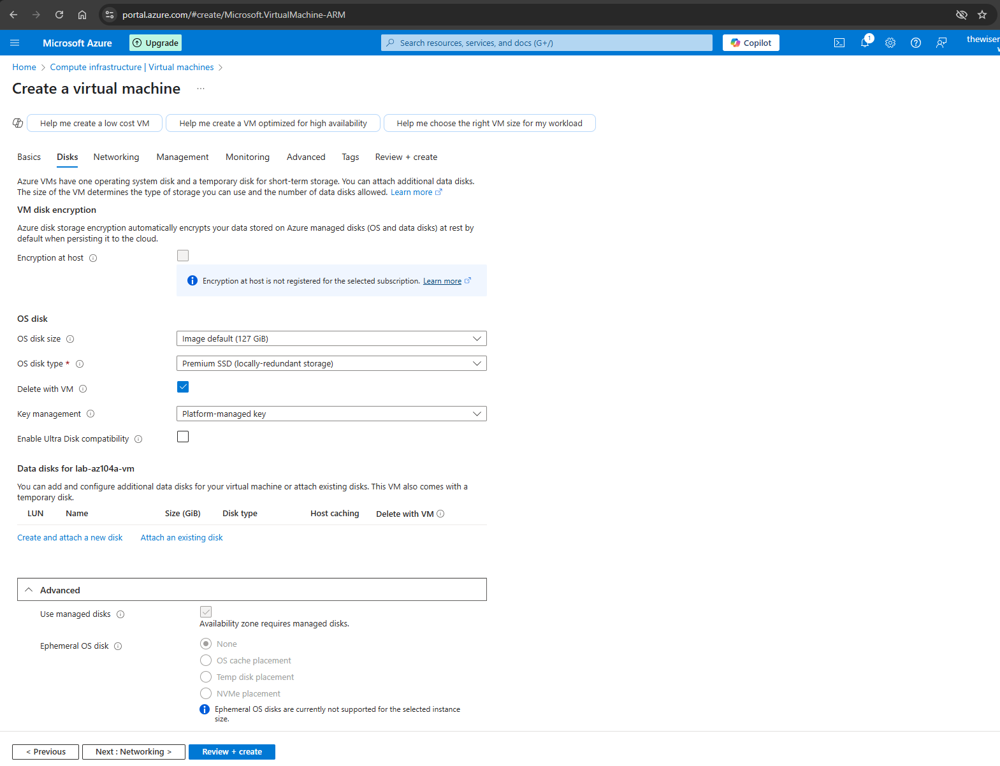

Step 5 - Networking - Choose Virtual network, Subnet, Public IP and other options.

*** If you do not have already a VNet and a Subnet created, the assistant will create one for you. For real life situations, consider previously planning this aspect of your environment.
*** Please pay attention to the option "Delete public IP and NIC when VM is deleted" in case of VM deletion.

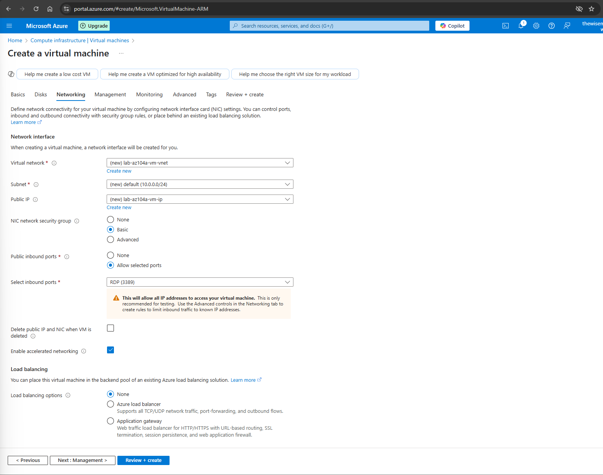

Step 6 - Management - No changes needed for this example.

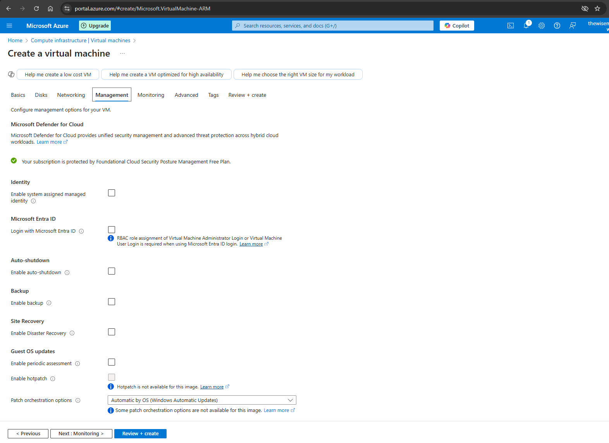

Step 7 - Monitoring - For this example let Boot diagnostics disabled.

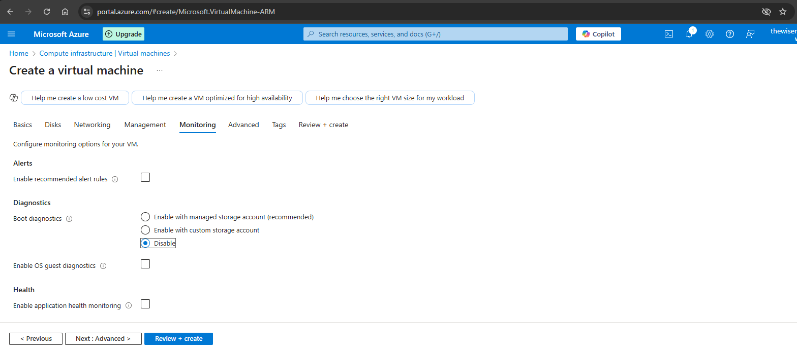

Step 8 - Advanced - No changes needed for this example.

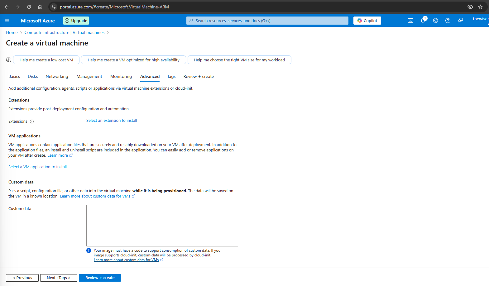

Step 9 - Tags - Inform all suitable tags.

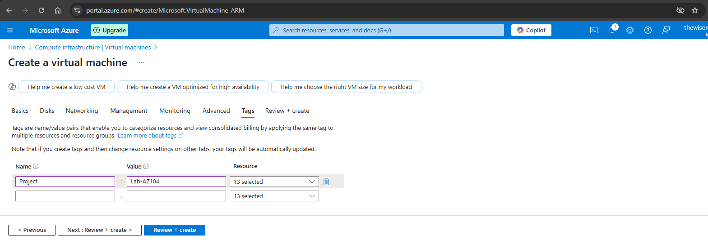

Step 10 - Review + Create - Wait for the validation pass and review the chosen options. Then click Create.

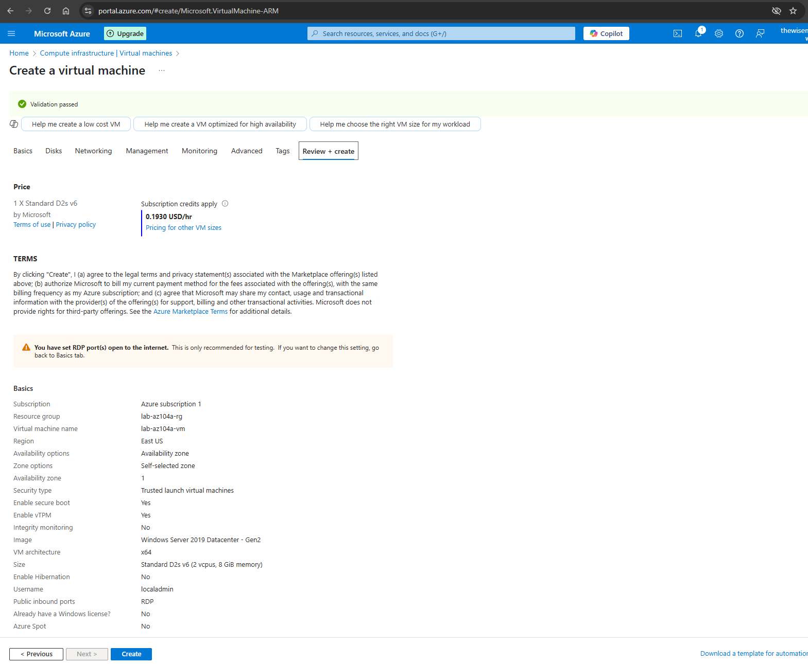

Step 11 - Wait some moment while Azure creates the VM. Once it is finished click on Go to resource.

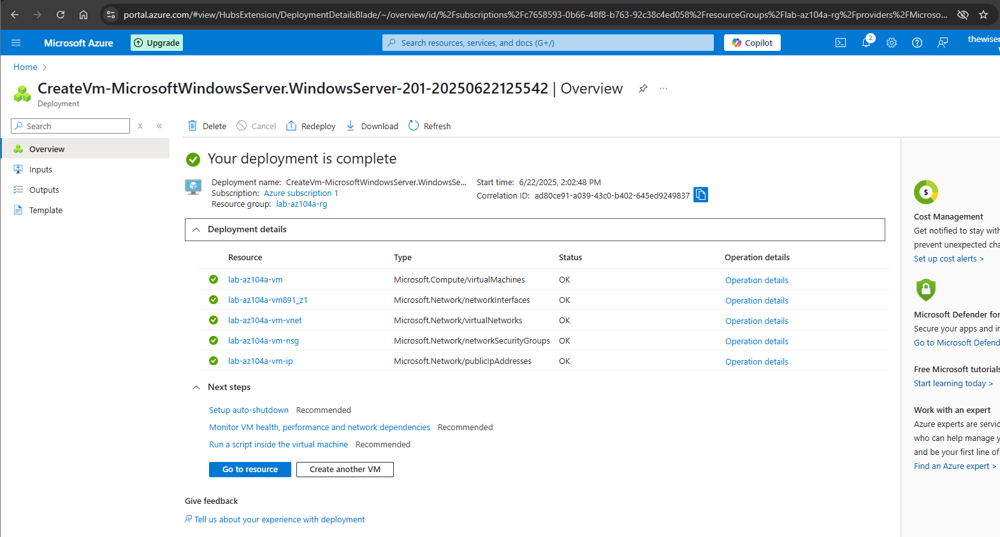

Step 12 - You can see all the related resources created into the resource group.

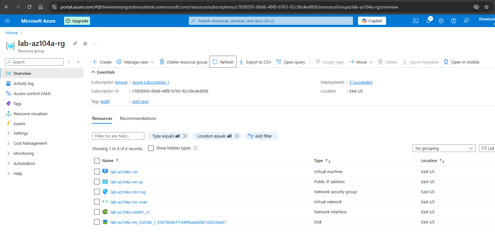
