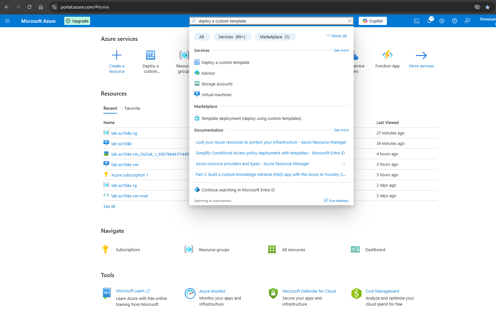
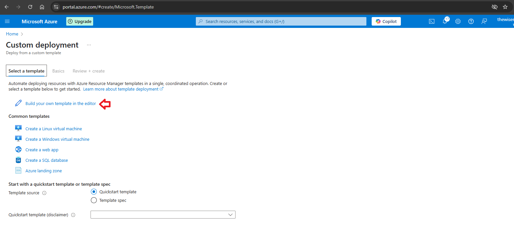
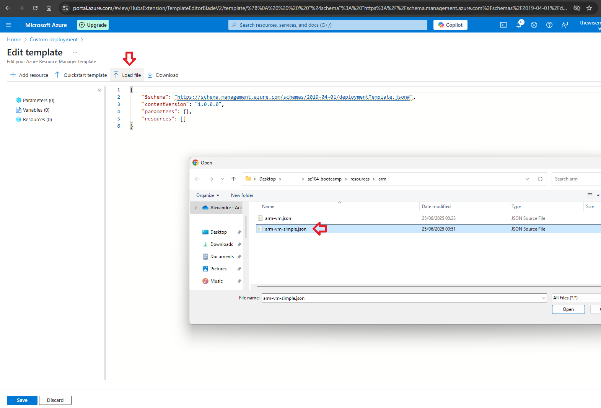
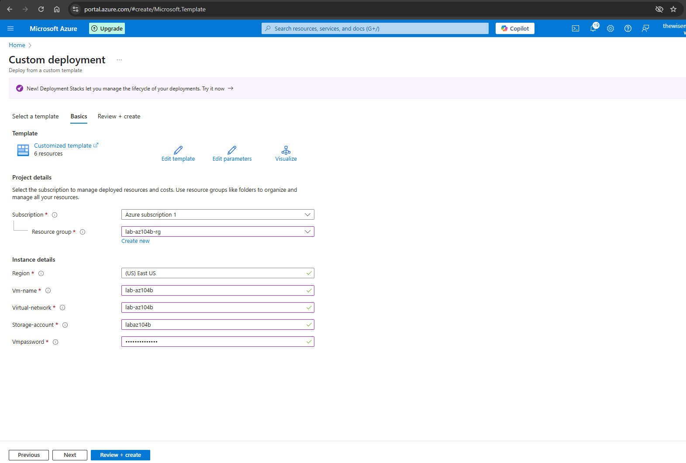
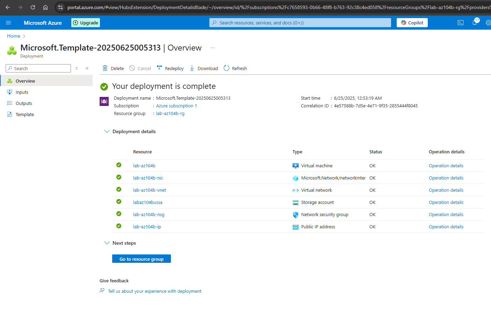

# Create a Virtual Machine Using an ARM Template

*** This article presumes you already have an active Azure account and are logged in https://portal.azure.com.

Step 1 - On the search bar type "deploy a custom template". Then click on Deploy a Custom Template.

Step 2 - In the Custom deployment section choose the option Build your own template in the editor.

Step 3 - Click on Load file to search and load the template JSON file. Then click Save.

Step 4 - Fulfill the required information for the template (Resource group, vm name, vnet name, storage account name, vm password). Then click Review + Create

Step 5 - All the resources related to the virtual machine were created successfully.

