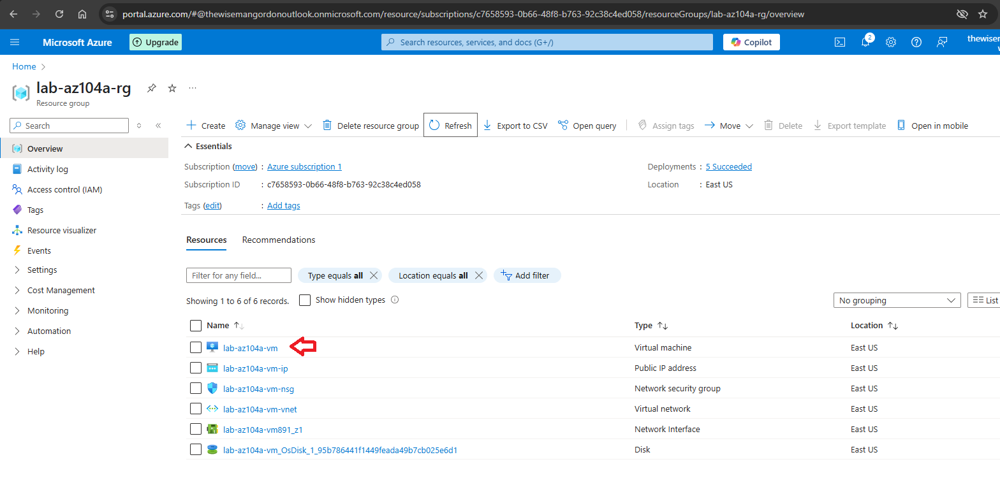
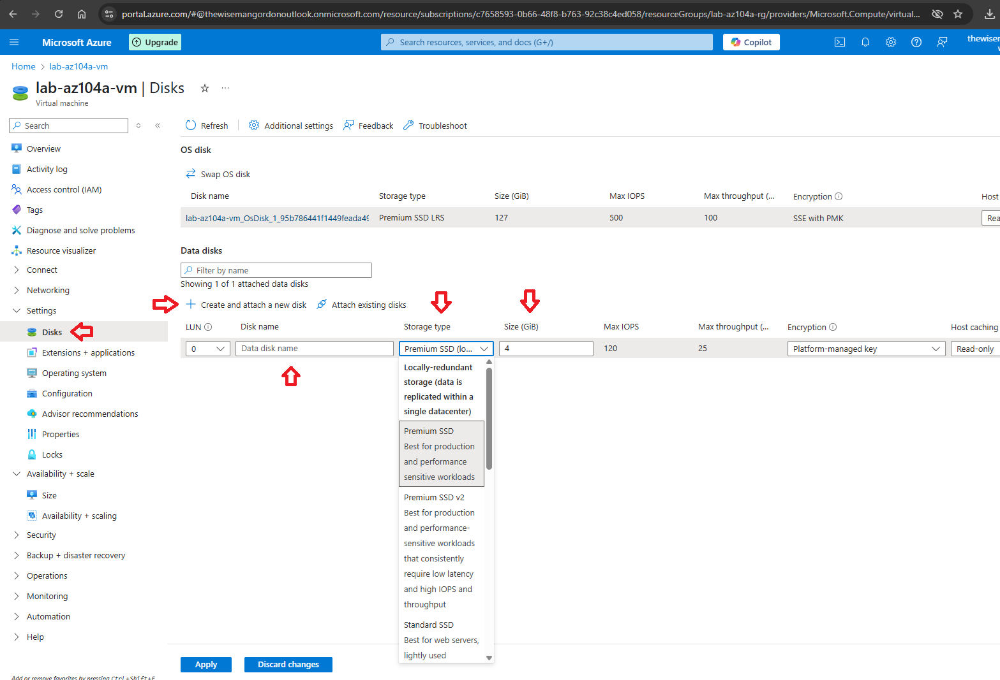
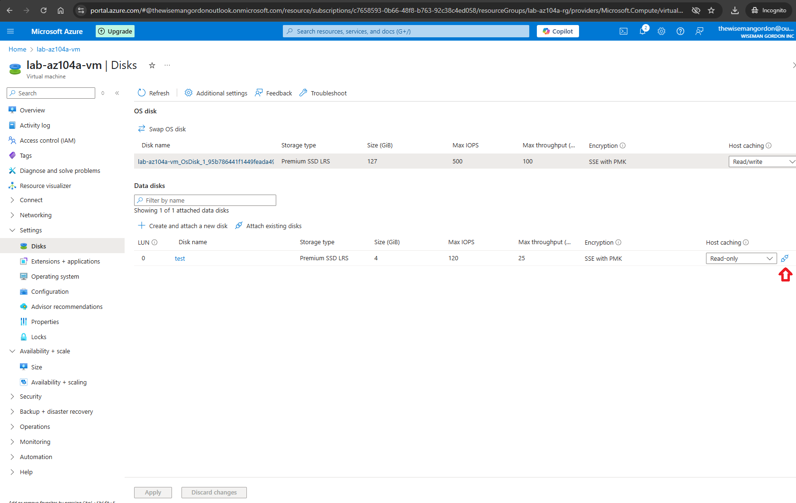
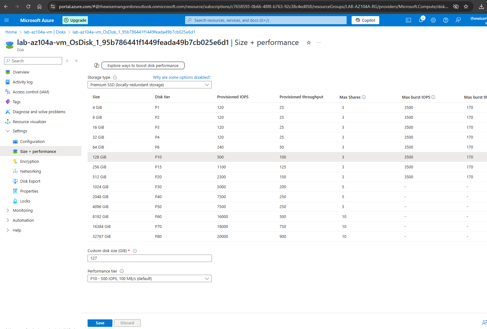

# Manage Virtual Machine Disks

*** This article presumes you already have an active Azure account and are logged in https://portal.azure.com.

Step 1 - In the resource group click on the virtual machine you want to change the disk.

Step 2 - Into the virtual machine page click on the Disks option and click Create and attach a new disk. Provide a Disk name, choose Storage type, Size, etc and then click Apply.

*** If you do not want to use an existing disk in the virtual machine you can dettach this disk. You can keep the disk because of its information and use it in other scenarios. You can also attach this disk to other virtual machine or delete it if it's not necessary anymore.

*** If you want to change configuration on existing disks, click on the existing to see its Overview panel. In the Setting panel you can change its configurations (example: Size + performance)

