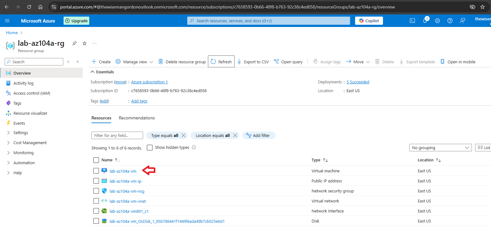

# Manage Virtual Machine Sizes

*** This article presumes you already have an active Azure account and are logged in https://portal.azure.com.

Step 1 - In the resource group click on the virtual machine you want to resize.

Step 2 - Into the virtual machine page click on the Size option you want. Then click Resize.

*** Important: If the virtual machine is running the resizing operation will restart it in order to apply its size change

Step 3 - Confirm the new virtual machine size.

