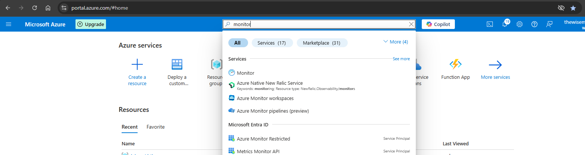
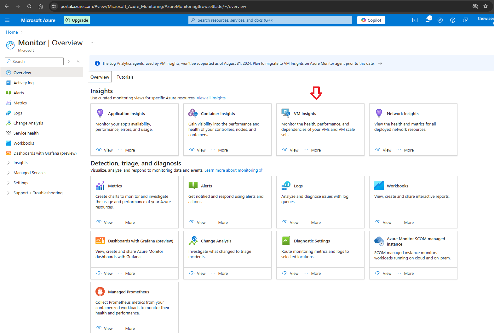
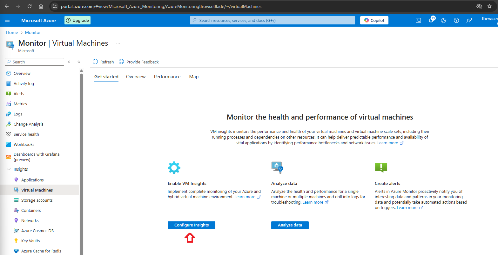
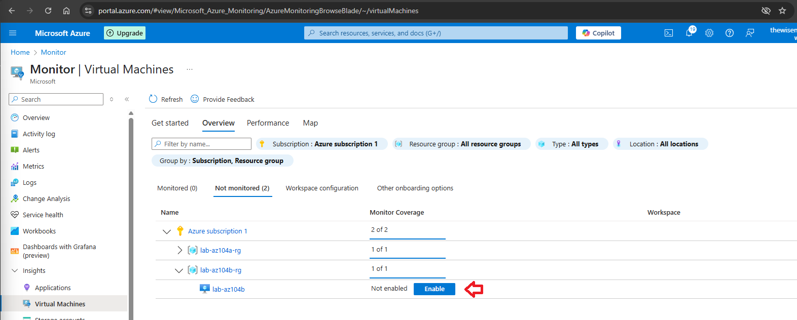
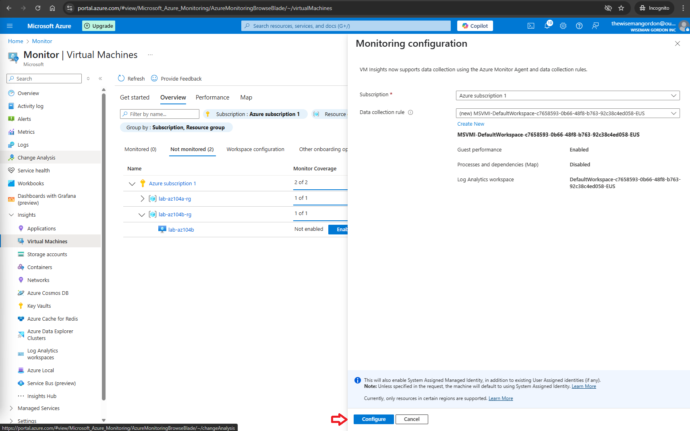
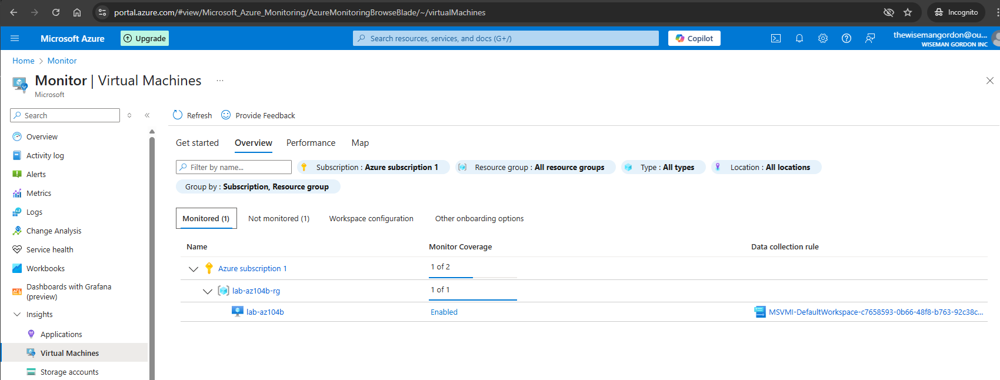

# Configure Log Settings in Azure Monitor

*** This article presumes you already have an active Azure account and are logged in https://portal.azure.com.

Step 1 - On the search bar type "Monitor". Then click on Monitor.

Step 2 - On the Monitor Overview page click on VM Insights.

Step 3 - Click on Configure Insights.

Step 4 - Search for the not monitored virtual machine you want to enable monitoring. Then click Enable.

Step 5 - Set an existing or create a new Data collection rule. Then click Configure.

Step 6 - The Monitor coverage changed to Enabled.

