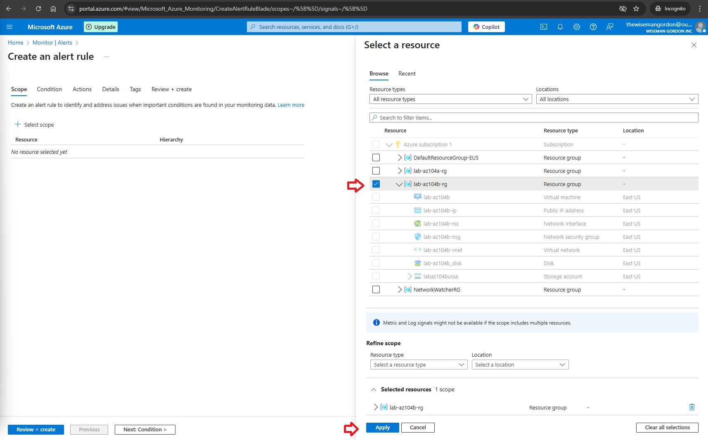
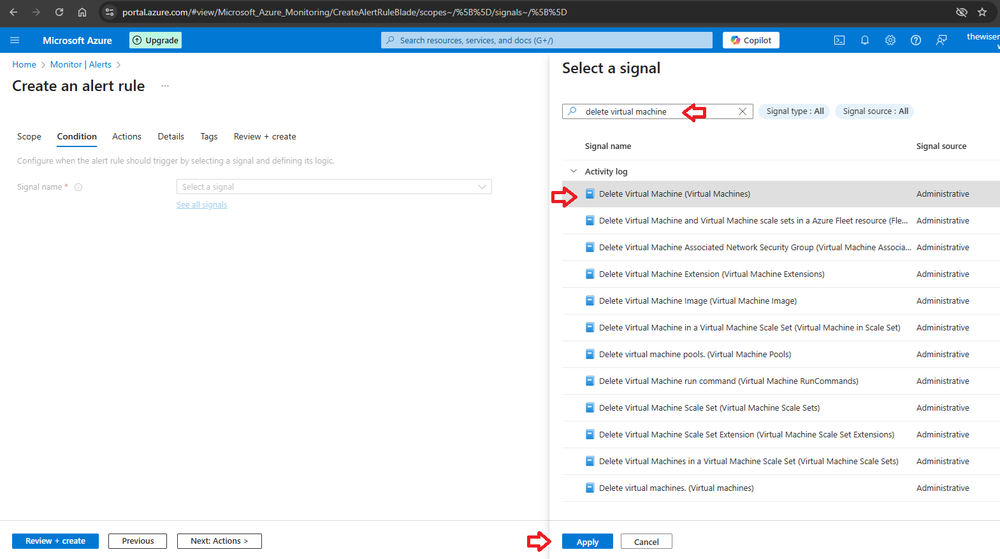

# Set up alert rules, action groups, and alert processing rules in Azure Monitor

*** This article presumes you already have an active Azure account and are logged in https://portal.azure.com.

*** To make it work first refer to [Configure Log Settings in Azure Monitor](configureLogSettingsInAzureMonitor.md) page to enable resource monitoring.

Step 1 - On the Monitor Overview page click on Alerts. Then click Create and choose the option Alert rule.

Step 2 - Select the Scope and then click Apply.

Step 3 - In Condition select a signal. Search for "delete virtual machine" and then click Apply.

Step 4 - In Actions select Use actions groups and click Create action group.

Step 5 - The Create action group will appear. In Basics fulfill the mandatory fields (resource group, action group name, display name).

Step 6 - In Notifications select the Notification type and give it a name. Also inform the e-mail address you want Azure to send the alerts.

Step 7 - In Actions and Tags no changes are need for this example. Then click Review + Create and click Create.

Step 8 - Now there is an action group created. Click Details.

Step 9 - In Details fulfill the mandatory fields (resource group, alert rule name). Then click Review + Create and click Create.

Step 10 - You will receive an e-mail informing you were added to an Azure Monitor action group.

Step 11 - To validate the alert just delete the virtual machine defined in the scope of the alert.

Step 12 - You will receive an e-mail informing the alert was activated.

